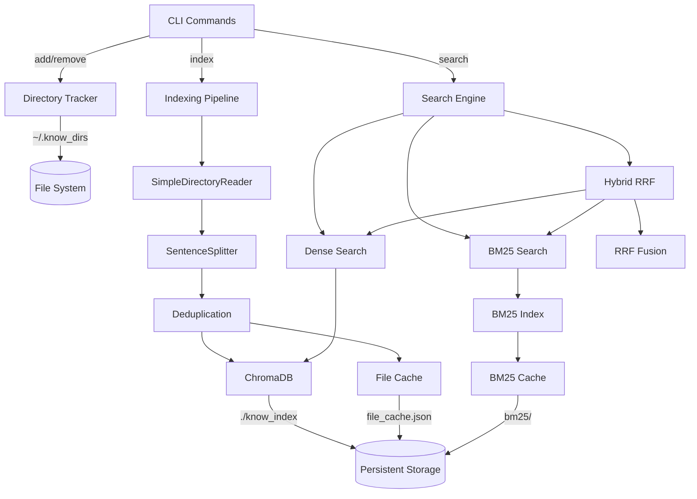
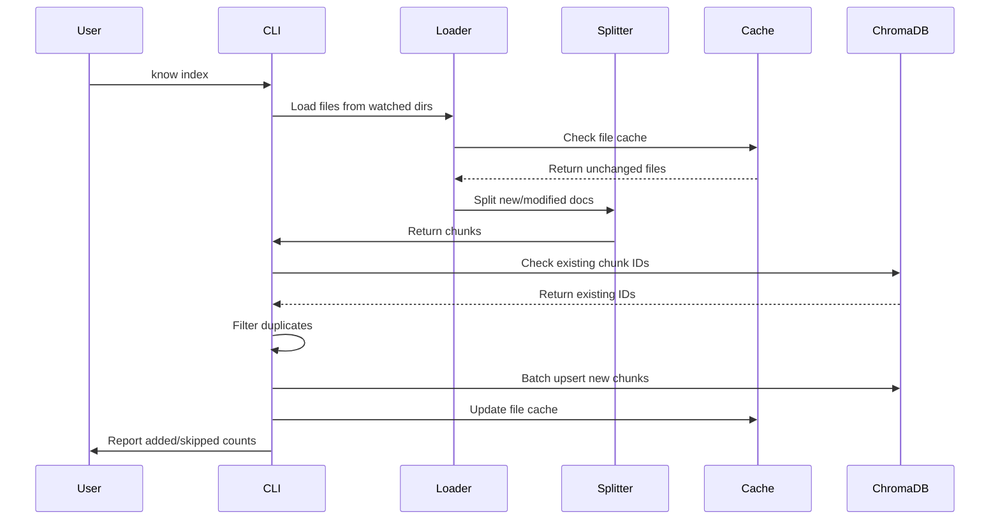
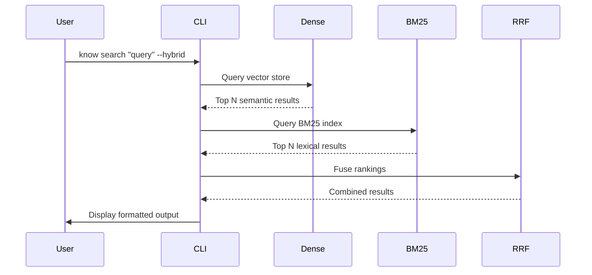

## Overview

know is a semantic search CLI that combines vector embeddings and lexical search to enable fast, accurate retrieval of information from local documents and code. The system is built on ChromaDB for vector storage, llama-index for document processing, and BM25 for lexical search.

## Architecture Diagram



## Core Components

### 1. Directory Tracker

**Location**: `src/know.py` (INDEX_FILE)

**Purpose**: Manages the list of directories to watch and index.

**Storage**: `~/.know_dirs` - Plain text file with one directory path per line

**Operations**:
- `add` - Append directory to watch list
- `remove` - Remove directory from watch list
- `dirs` - Display all watched directories

### 2. Document Loader

**Library**: llama-index `SimpleDirectoryReader`

**Configuration**:
```python
SimpleDirectoryReader(
    input_dir=directory,
    recursive=True,              # Scan subdirectories
    required_exts=extensions,    # Filter by file extension
    filename_as_id=True          # Use file path as document ID
)
```

**Features**:
- Automatic file type detection based on extension
- Recursive directory traversal
- Glob pattern filtering
- Modification time filtering (`--since`)

### 3. Text Chunking

**Library**: llama-index `SentenceSplitter`

**Default Configuration**:
- **Chunk size**: 512 tokens
- **Chunk overlap**: 50 tokens

**Purpose**: Split documents into semantically meaningful chunks for embedding and retrieval.

**Chunk Format**:
```python
chunk_text = f"{filename}\n\n{content}"
```

Each chunk includes the filename as a prefix to improve context during search.

### 4. Deduplication System

**Method**: MD5 hash of `path:chunk_index:text`

**Location**: `src/db.py:201-203`

**Implementation**:
```python
chunk_id = hashlib.md5(
    f"{source_path}:{chunk_index}:{node.text}".encode()
).hexdigest()
```

**Deduplication Stages**:
1. **Existing chunks**: Check against ChromaDB for already-indexed chunks
2. **Within-batch duplicates**: Track seen IDs to prevent duplicate inserts
3. **Collision detection**: Report chunks with identical content from different files

### 5. Vector Store (ChromaDB)

**Type**: `chromadb.PersistentClient`

**Location**: `./know_index` (relative to working directory)

**Collection**: `documents`

**Metadata Schema**:
```python
{
    "path": str,           # Full file path
    "filename": str,       # Base filename
    "extension": str,      # File extension (e.g., ".py")
    "size_bytes": int,     # File size in bytes
    "chunk_index": int,    # Chunk position in document
    "node_id": str         # llama-index node identifier
}
```

**Embedding**: ChromaDB's default embedding model (all-MiniLM-L6-v2)

**Operations**:
- `upsert()` - Add or update chunks in batches of 100
- `query()` - Semantic similarity search with cosine distance
- `get()` - Retrieve chunks by ID or metadata filters
- `delete()` - Remove chunks (used by `prune` command)

### 6. BM25 Lexical Search

**Library**: `bm25s` with PyStemmer

**Cache Location**: `./know_index/bm25/`

**Cache Files**:
- `meta.json` - Document count for cache validation
- `ids.json` - List of chunk IDs in index order
- BM25 index files (managed by bm25s)

**Configuration**:
```python
bm25s.tokenize(
    documents,
    stopwords="en",        # English stopwords
    stemmer=Stemmer.Stemmer("english"),
    show_progress=False
)
```

**Cache Invalidation**: BM25 index is rebuilt if document count changes.

**Query Process**:
1. Check if cached index exists and matches current document count
2. If cache miss: retrieve all documents, build BM25 index, save cache
3. If cache hit: load pre-built index and ID mapping
4. Tokenize query and retrieve top-k ranked results

### 7. File Cache

**Location**: `./know_index/file_cache.json`

**Purpose**: Skip re-indexing unchanged files for faster incremental updates.

**Schema**:
```json
{
  "config": {
    "chunk_size": 512,
    "chunk_overlap": 50
  },
  "files": {
    "/path/to/file.py": {
      "mtime": 1234567890.123,
      "size": 4096,
      "indexed": true
    }
  }
}
```

**Cache Validation**:
- File is skipped if `mtime` and `size` match cached values
- Cache is invalidated if chunk size or overlap settings change
- Cache entries are cleaned during `prune` operation

### 8. Search Engine

**Modes**:

#### Dense (Vector) Search
```bash
know search "query"  # Default mode
```
- Uses ChromaDB's embedding-based semantic search
- Returns results sorted by cosine distance
- Best for conceptual and semantic queries

#### BM25 (Lexical) Search
```bash
know search "query" --bm25
```
- Uses BM25 term-frequency ranking
- Returns results sorted by BM25 score
- Best for exact term matches and keyword queries

#### Hybrid Search
```bash
know search "query" --hybrid
```
- Combines dense and BM25 results using Reciprocal Rank Fusion (RRF)
- Fetches 3x candidate results from each method
- Fuses rankings with RRF (k=60)
- Returns top results by fused score
- Best for balanced recall and precision

**RRF Formula**:
```
score(doc) = Σ 1/(k + rank_i)
```
where `k=60` and `rank_i` is the rank from each retrieval method.

## Data Flow

### Indexing Flow



### Search Flow



## Storage Layout

```
./know_index/
├── chroma.sqlite3           # ChromaDB metadata database
├── [uuid]/                   # ChromaDB collection data
│   ├── data_level0.bin      # Vector embeddings
│   ├── header.bin           # Collection metadata
│   ├── length.bin           # Document lengths
│   └── link_lists.bin       # HNSW graph links
├── bm25/                     # BM25 cache directory
│   ├── meta.json            # Document count
│   ├── ids.json             # Chunk ID mapping
│   └── [bm25s index files]  # Pre-built BM25 index
└── file_cache.json          # File modification cache

~/.know_dirs                  # Watched directories list
```

## Performance Optimizations

### Batch Processing
- Documents are upserted to ChromaDB in batches of 100
- Existing ID checks are batched to reduce round trips
- BM25 queries fetch 3x candidates to account for filtering

### Caching Strategies
1. **File Cache**: Skip unchanged files based on mtime/size
2. **BM25 Cache**: Persist pre-built BM25 index between searches
3. **ID Deduplication**: Track seen IDs in-memory to avoid duplicate processing

### Incremental Updates
- Only new and modified files are processed during re-indexing
- Existing chunks are preserved and reused
- Cache invalidation ensures consistency with configuration changes

## Dependencies

### Core Libraries
- **chromadb**: Vector database with embedding generation
- **llama-index-core**: Document loading and text splitting
- **bm25s**: Fast BM25 implementation
- **PyStemmer**: English word stemming for BM25
- **typer**: CLI framework with type annotations
- **rich**: Terminal output formatting and progress bars

### Storage Requirements
- **Vector embeddings**: ~384 dimensions × 4 bytes per chunk
- **BM25 index**: Sparse matrix (~10-20% of document size)
- **File cache**: ~100 bytes per indexed file
- **ChromaDB overhead**: SQLite metadata (~1-5% of total)

## Related Documentation

- [Supported File Types](/reference/supported-files) - List of indexable extensions
- [FAQ](/reference/faq) - Common questions and troubleshooting
- [Commands Reference](/commands/search) - Command documentation